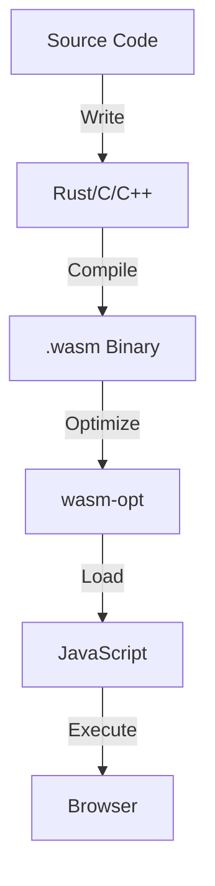

# Environment Setup

Let's set up a complete WebAssembly development environment step by step.

## Required Tools

| Tool | Purpose | Required |
|------|---------|----------|
| **Rust** | Compile Rust to WASM | Recommended |
| **wasm-pack** | Build Rust → WASM | Recommended |
| **wasm-opt** | Optimize WASM binary | Optional |
| **wat2wasm** | Compile WAT to WASM | Optional |
| **Node.js** | Run/test WASM | Yes |

## Quick Install (Recommended)

Fastest way is using Rust + WASM:

```bash
# Install Rust (if not installed)
curl --proto '=https' --tlsv1.2 -sSf https://sh.rustup.rs | sh

# Add WASM compilation target
rustup target add wasm32-unknown-unknown

# Install wasm-pack
cargo install wasm-pack
```

## Verify Installation

Check tools are working:

```bash
# Check Rust
rustc --version
# rustc 1.XX.X

# Check wasm-pack
wasm-pack --version
# wasm-pack X.XX.X

# Check Node.js
node --version
# vXX.X.X
```

## Development Workflow



## First Project

Create and build a simple Rust WASM library:

```bash
# Create new project
cargo new --lib my-wasm-lib

# Edit Cargo.toml
[package]
name = "my-wasm-lib"
version = "0.1.0"
edition = "2021"

[lib]
crate-type = ["cdylib"]

[dependencies]
wasm-bindgen = "0.2"
```

```rust
// src/lib.rs
use wasm_bindgen::prelude::*;

#[wasm_bindgen]
pub fn add(a: i32, b: i32) -> i32 {
    a + b
}
```

Build:

```bash
wasm-pack build
```

## VS Code Extensions

Recommended extensions for WASM development:

- **WebAssembly Toolkit** — Syntax highlighting for .wat files
- **Rust Analyzer** — Rust language support
- **WASM Explorer** — Online WASM viewer

---

Environment ready! Let's create your [first WASM module](./3-first-module).
