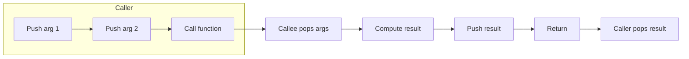

# Call Convention

Understanding WebAssembly's call convention is essential for interop between WASM and JavaScript (or other languages).

## Stack-based Call Convention

WebAssembly uses a stack-based call convention:



## Local Variables

```wat
(func $factorial (param $n i32) (result i32)
  (local $result i32)
  (local $temp i32)

  (local.set $result (i32.const 1))

  (block $done (result i32)
    (loop $loop
      (br_if $done (i32.le_s (local.get $n) (i32.const 1)))
      (local.set $temp (local.get $result))
      (local.set $result (i32.mul (local.get $result) (local.get $n)))
      (local.set $n (i32.sub (local.get $n) (i32.const 1)))
      (br $loop))
    (local.get $result)))
```

## Branching and Control Flow

### If-Else

```wat
(func $max (param $a i32) (param $b i32) (result i32)
  (if (i32.gt_s (local.get $a) (local.get $b))
    (then (local.get $a))
    (else (local.get $b))))
```

### Loop

```wat
(func $sum_to (param $n i32) (result i32)
  (local $sum i32)
  (local.set $sum (i32.const 0))
  (block $done
    (loop $start
      (br_if $done (i32.eqz (local.get $n)))
      (local.set $sum (i32.add (local.get $sum) (local.get $n)))
      (local.set $n (i32.sub (local.get $n) (i32.const 1)))
      (br $start)))
  (local.get $sum))
```

## Performance Tips

| Technique | Note |
|-----------|------|
| Use smaller types | i32 faster than i64 on 32-bit architectures |
| Minimize parameters | Pass structs via pointer, not by value |
| Inline small functions | Reduce call overhead |
| Avoid excessive branching | Deep branching affects performance |

---

Continue learning [Import and Export](./3-import-export) to understand module communication.
