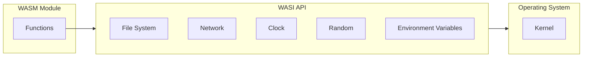

# WASI - WebAssembly System Interface

WASI (WebAssembly System Interface) is a modular system interface for WebAssembly. It enables WASM modules to run safely outside the browser and access operating system resources.

## What is WASI?



## Core Components

### WASI SDK

```bash
# Download WASI SDK
curl -LO https://github.com/WebAssembly/wasi-sdk/releases/download/wasi-sdk-20/wasi-sdk-20.0-linux-x86_64.tar.gz
tar -xzf wasi-sdk-20.0-linux-x86_64.tar.gz

# Set environment
export WASI_SDK_PATH=$PWD/wasi-sdk-20.0
```

### Compile with WASI

```bash
# C/C++ with WASI
$WASI_SDK_PATH/bin/clang \
  --target=wasm32-wasi \
  --sysroot=$WASI_SDK_PATH/share/wasi-sysroot \
  source.c -o output.wasm

# Rust with WASI
cargo build --target wasm32-wasi --release
```

## Common Use Cases

| Use Case | Example | Benefits |
|----------|---------|----------|
| Serverless functions | AWS Lambda Edge | Cold start performance |
| CLI tools | wapm packages | Cross-platform binaries |
| Plugin systems | Secure sandbox | Isolation + capability |
| Edge computing | CDN functions | Fast execution |

## Security Model

WASI uses a capability-based security model:

- No ambient authority
- Resources explicitly passed
- Least privilege

## Tool Ecosystem

| Tool | Purpose |
|------|---------|
| Wasmtime | Runtime (CLI + library) |
| WasmEdge | High-performance runtime |
| wasmer | General-purpose runtime |
| wapm | Package registry |
| cargo-wasi | Rust WASI support |

---

Continue learning [Major Frameworks](./4-frameworks).
