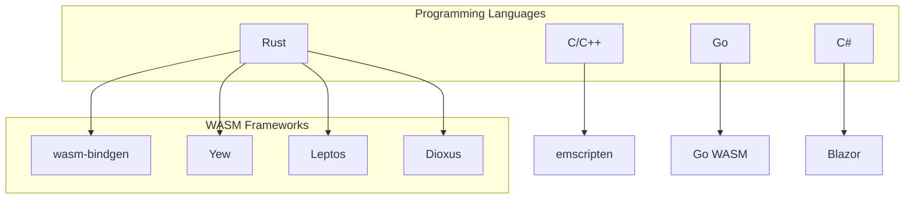

# Major Frameworks and Libraries

A comprehensive guide to WebAssembly frameworks and libraries.

## Overview



## Rust Frameworks

### Yew - React for Rust

```rust
use yew::prelude::*;

#[function_component(App)]
fn app() -> Html {
    let counter = use_state(|| 0);

    let onclick = {
        let counter = counter.clone();
        Callback::from(move |_| counter.set(*counter + 1))
    };

    html! {
        <div>
            <button {onclick}>{ format!("Count: {}", *counter) }</button>
        </div>
    }
}

fn main() {
    yew::start_app::<App>();
}
```

### Leptos - Fine-grained Reactivity

```rust
use leptos::*;

#[component]
fn Counter() -> impl IntoView {
    let (count, set_count) = create_signal(0);

    view! {
        <button
            on:click=move |_| set_count.update(|n| *n += 1)>
            {count}
        </button>
    }
}

pub fn main() {
    mount_to_body(|| view! { <Counter /> });
}
```

### Dioxus - Cross-platform UI

```rust
use dioxus::prelude::*;

fn App() -> Element {
    let mut count = use_signal(0);

    rsx! {
        button { onclick: move |_| count += 1, "Count: {count}" }
    }
}

fn main() {
    launch(App);
}
```

## Toolchain

### wasm-pack

| Command | Description |
|---------|-------------|
| `wasm-pack build` | Build package |
| `wasm-pack test` | Run tests |
| `wasm-pack publish` | Publish to npm |

### wasm-bindgen-cli

```bash
# Install
cargo install wasm-bindgen-cli

# Generate bindings
wasm-bindgen target/wasm32-unknown-unknown/release/lib.wasm \
  --out-dir pkg \
  --target web
```

### wasm-opt

```bash
# Install
cargo install wasm-opt

# Optimize
wasm-opt -O3 input.wasm -o output.wasm

# Optimize for size
wasm-opt -Oz input.wasm -o output.wasm
```

## C/C++ with Emscripten

```bash
# Install emscripten
git clone https://github.com/emscripten-core/emsdk.git
cd emsdk
./emsdk install latest
./emsdk activate latest
source ./emsdk_env.sh

# Compile C to WASM
emcc input.c -o output.js
```

## Testing

### Rust Testing

```rust
#[cfg(test)]
mod tests {
    use super::*;

    #[test]
    fn test_add() {
        assert_eq!(add(2, 3), 5);
    }

    #[test]
    fn test_fibonacci() {
        assert_eq!(fibonacci(10), 55);
    }
}
```

```bash
wasm-pack test --node
```

---

Congratulations on completing the WebAssembly module! You're now ready to build real WASM applications!

## Next Steps

1. Build your first Rust WASM project
2. Try building UI with Yew or Leptos
3. Try compiling C/C++ with Emscripten
4. Explore WASI for server-side WASM

Happy coding!
