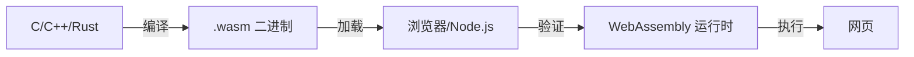

# 什么是 WebAssembly？

WebAssembly（简称 WASM）是一种紧凑的二进制指令格式，专为作为编程语言的可移植编译目标而设计。它使得高性能应用能够在网页中运行。

## 核心特性

| 特性 | 描述 |
|------|------|
| **二进制格式** | 高效的二进制编码代码 |
| **栈式虚拟机** | 基于栈的上推/弹出架构 |
| **类型安全** | 强类型系统，仅四种值类型 |
| **内存模型** | 可动态增长的线性内存 |
| **沙箱隔离** | 隔离的执行环境 |

## 工作原理



## WebAssembly vs JavaScript

| 方面 | JavaScript | WebAssembly |
|------|------------|-------------|
| 格式 | 文本 | 二进制 |
| 解析速度 | 较慢 | 更快 |
| 执行方式 | JIT 编译 | 直接执行 |
| 类型系统 | 动态类型 | 静态类型 |
| GC 支持 | 内置 | 有限 |
| DOM 访问 | 直接访问 | 通过 JS 互操作 |

## 何时使用 WASM

在以下场景使用 WebAssembly：

- **性能关键代码** —— 图像/视频处理、游戏引擎、编解码器
- **移植现有代码库** —— 在 Web 中复用 C/C++/Rust 库
- **计算密集型任务** —— 科学计算、加密、压缩
- **接近原生的性能** —— 信号处理、物理模拟

::: tip
WebAssembly 不会取代 JavaScript —— 它是 JavaScript 的补充。在处理密集型计算时使用 WASM，同时保留 JavaScript 用于 DOM 操作和业务逻辑。
:::

## 浏览器支持

所有现代浏览器都支持 WebAssembly：

| 浏览器 | 支持版本 |
|--------|----------|
| Chrome | 57+ |
| Firefox | 52+ |
| Safari | 11+ |
| Edge | 16+ |

## 初体验

WASM 的简单示例：

```wat
;; WAT（WebAssembly Text Format）— 人类可读的表示形式
(module
  (func $add (param i32 i32) (result i32)
    local.get 0
    local.get 1
    i32.add)
  (export "add" (func $add)))
```

从 JavaScript 执行：

```javascript
// 导出的函数可以直接调用
const result = instance.exports.add(40, 2);
console.log(result); // 42
```

## 接下来

现在你已经了解了什么是 WebAssembly，让我们[搭建开发环境](./2-setup-env)。
