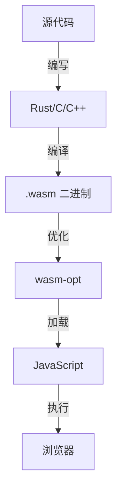

# 环境搭建

让我们一步步搭建完整的 WebAssembly 开发环境。

## 必需工具

| 工具 | 用途 | 必需性 |
|------|------|--------|
| **Rust** | 编译 Rust 到 WASM | 推荐 |
| **wasm-pack** | 构建 Rust → WASM | 推荐 |
| **wasm-opt** | 优化 WASM 二进制文件 | 可选 |
| **wat2wasm** | 编译 WAT 到 WASM | 可选 |
| **Node.js** | 运行/测试 WASM | 是 |

## 快速安装（推荐）

最快的方式是使用 Rust + WASM：

```bash
# 安装 Rust（如未安装）
curl --proto '=https' --tlsv1.2 -sSf https://sh.rustup.rs | sh

# 添加 WASM 编译目标
rustup target add wasm32-unknown-unknown

# 安装 wasm-pack
cargo install wasm-pack
```

## WebAssembly 文本格式工具链

用于学习 WAT（人类可读的 WASM 格式）：

```bash
# macOS
brew install wabt

# Linux
sudo apt install wabt

# Windows（使用 Chocolatey）
choco install wabt
```

## 验证安装

检查工具是否正常工作：

```bash
# 检查 Rust
rustc --version
# rustc 1.XX.X

# 检查 wasm-pack
wasm-pack --version
# wasm-pack X.XX.X

# 检查 Node.js
node --version
# vXX.X.X
```

## 开发工作流程



## 项目结构

一个典型的 Rust WASM 项目：

```
my-wasm-project/
├── Cargo.toml          # 项目清单
├── src/
│   └── lib.rs          # Rust 源代码
├── pkg/                # 生成的 WASM 输出
│   ├── my_wasm_project_bg.wasm
│   └── my_wasm_project.js
└── src/                # JavaScript 前端
    └── index.js
```

## 第一个项目

创建并构建一个简单的 Rust WASM 库：

```bash
# 创建新项目
cargo new --lib my-wasm-lib

# 编辑 Cargo.toml
[package]
name = "my-wasm-lib"
version = "0.1.0"
edition = "2021"

[lib]
crate-type = ["cdylib"]

[dependencies]
wasm-bindgen = "0.2"
```

```rust
// src/lib.rs
use wasm_bindgen::prelude::*;

#[wasm_bindgen]
pub fn add(a: i32, b: i32) -> i32 {
    a + b
}
```

构建：

```bash
wasm-pack build
```

## 本地测试

创建 HTML 文件进行测试：

```html
<!DOCTYPE html>
<html>
<head>
    <title>WASM 测试</title>
</head>
<body>
    <h1>我的第一个 WASM 模块</h1>
    <div id="result"></div>

    <script type="module">
        const wasm = await WebAssembly.instantiateStreaming(
            fetch('/pkg/my_wasm_lib_bg.wasm')
        );
        console.log(wasm.instance.exports.add(2, 3)); // 5
    </script>
</body>
</html>
```

## VS Code 扩展

推荐用于 WASM 开发的扩展：

- **WebAssembly Toolkit** — .wat 文件的语法高亮
- **Rust Analyzer** — Rust 语言支持
- **WASM Explorer** — 在线 WASM 查看器

---

环境准备就绪，让我们创建[第一个 WASM 模块](./3-first-module)！

## 启动开发服务器

```bash
# 使用 bun
bunx vitepress dev docs

# 或使用 npm
npm run dev
```

访问 http://localhost:5173 查看网站。

## 常见问题

### Q: wasm-pack 构建失败？

确保已安装 Rust 和 wasm-pack，并添加了 WASM 目标：

```bash
rustup target add wasm32-unknown-unknown
```

### Q: WAT 文件无法编译？

安装 wabt 工具链：

```bash
# Windows (需要管理员权限)
choco install wabt

# 或使用 npm 安装
npm install -g wabt
```
