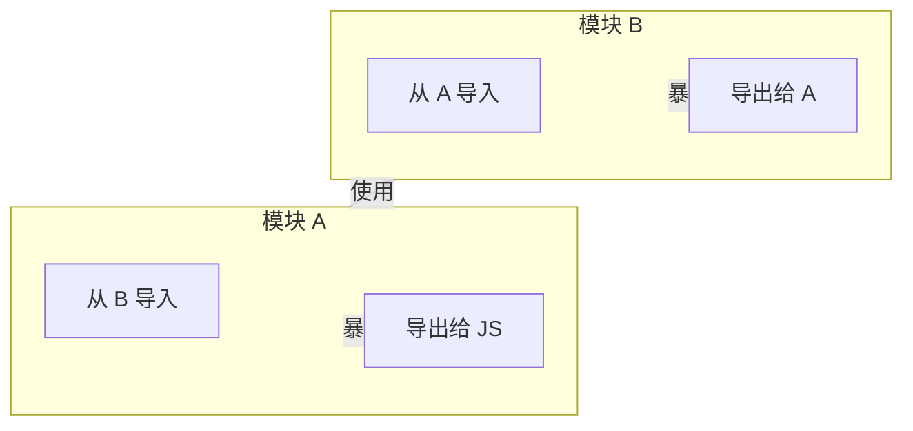

# 导入和导出

WebAssembly 模块通过定义良好的导入/导出系统进行通信。这使得强大的模块间通信成为可能。

## 导出系统

导出使函数、内存和表格对外部世界可用。

### 导出函数

```wat
(module
  (func (export "greet") (result i32)
    (i32.const 42)))

;; JavaScript 使用：
const result = instance.exports.greet(); // 42
```

### 导出内存

```wat
(module
  (memory (export "memory") 1))

;; JavaScript 使用：
const memory = instance.exports.memory;
const view = new Uint8Array(memory.buffer);
view[0] = 100;
```

## 导入系统

导入允许 WASM 使用宿主环境提供的函数和内存。

### 基础导入

```wat
(module
  (import "env" "log" (func $log (param i32)))
  (func (export "process") (param i32 i32)
    local.get 0
    local.get 1
    i32.add
    call $log))
```

```javascript
const importObject = {
  env: {
    log: (value) => console.log('WASM 说:', value)
  }
};

const { instance } = await WebAssembly.instantiate(wasmBytes, importObject);
```

## 宿主函数

```rust
use wasm_bindgen::prelude::*;

#[wasm_bindgen]
extern "C" {
    #[wasm_bindgen(js_namespace = console)]
    fn log(s: &str);
}

#[wasm_bindgen]
pub fn process(data: &str) {
    log(&format!("处理中: {}", data));
}
```

## 跨模块通信



## 最佳实践

1. **命名空间组织** — 按命名空间分组导入（`console`, `env`, `js`）
2. **类型安全** — 精确匹配 WASM 类型和导入签名
3. **错误处理** — 使用错误码或异常
4. **最小化导入** — 每个导入都有开销

---

继续学习[类型系统](./4-types)获取详细的类型信息。
