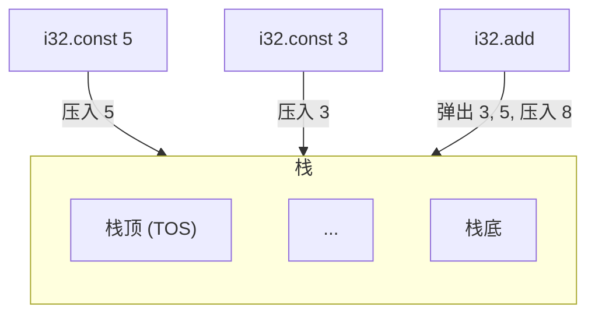

# WAT 文本格式

WebAssembly 文本格式（WAT）是 WebAssembly 二进制格式的人类可读文本表示。理解 WAT 有助于深入理解 WASM 的工作原理。

## 为什么学习 WAT？

- **调试** — 阅读编译后的 WASM 输出
- **学习** — 深入理解 WASM 语义
- **优化** — 编写高效的底层代码
- **测试** — 验证二进制输出

## 基本语法

### 模块结构

```wat
(module
  ;; 使用 ;; 注释
  (func $name ...)
  (memory ...)
  (table ...)
  (global ...))
```

## 函数

### 基础函数

```wat
;; 返回 42 的函数
(module
  (func (export "answer") (result i32)
    (i32.const 42)))
```

### 带参数的函数

```wat
(module
  (func (export "add") (param $a i32) (param $b i32) (result i32)
    local.get $a
    local.get $b
    i32.add))
```

## 栈式机器

WASM 是一个栈式机器 — 指令在栈上操作：



## 指令参考

### 常量

```wat
(i32.const 42)     ;; 压入 i32 常量
(i64.const 9223372036854775807)  ;; 压入 i64
(f32.const 3.14)   ;; 压入 f32
(f64.const 2.718281828)  ;; 压入 f64
```

### 局部变量

```wat
(local.get $x)      ;; 压入局部变量
(local.set $x)      ;; 弹出并存储到局部变量
(local.tee $x)       ;; 复制栈顶，然后存储
```

### 内存操作

```wat
(i32.load (i32.const 0))        ;; 从地址 0 加载 i32
(i64.load8_s (i32.const 10))    ;; 加载 i8 并符号扩展为 i64
(i32.store (i32.const 0))       ;; 弹出值，存储到地址 0
(i32.store8 (i32.const 0))      ;; 存储最低字节
```

## 控制流

### If-Else

```wat
(func (export "abs") (param $x i32) (result i32)
  (if (i32.lt_s (local.get $x) (i32.const 0))
    (then (i32.sub (i32.const 0) (local.get $x)))
    (else (local.get $x))))
```

### 循环

```wat
(func (export "sum_to") (param $n i32) (result i32)
  (local $sum i32)
  (local.set $sum (i32.const 0))
  (block $done
    (loop $continue
      (br_if $done (i32.eqz (local.get $n)))
      (local.set $sum (i32.add (local.get $sum) (local.get $n)))
      (local.set $n (i32.sub (local.get $n) (i32.const 1)))
      (br $continue)))
  (local.get $sum))
```

## 工具

### WAT 转 WASM

```bash
# 安装 wabt（WebAssembly 二进制工具包）
# macOS
brew install wabt
# Linux
sudo apt install wabt

# WAT 转 WASM
wat2wasm input.wat -o output.wasm

# WASM 转 WAT
wasm2wat input.wasm -o output.wat
```

---

继续学习 [性能优化](./3-performance)。
