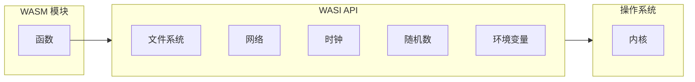

# WASI - WebAssembly 系统接口

WASI（WebAssembly System Interface）是一个面向 WebAssembly 的模块化系统接口。它使 WASM 模块能够在浏览器外部安全运行，并访问操作系统资源。

## 什么是 WASI？



## 核心组件

### WASI SDK

```bash
# 下载 WASI SDK
curl -LO https://github.com/WebAssembly/wasi-sdk/releases/download/wasi-sdk-20/wasi-sdk-20.0-linux-x86_64.tar.gz
tar -xzf wasi-sdk-20.0-linux-x86_64.tar.gz

# 设置环境
export WASI_SDK_PATH=$PWD/wasi-sdk-20.0
```

### 使用 WASI 编译

```bash
# C/C++ 使用 WASI
$WASI_SDK_PATH/bin/clang \
  --target=wasm32-wasi \
  --sysroot=$WASI_SDK_PATH/share/wasi-sysroot \
  source.c -o output.wasm

# Rust 使用 WASI
cargo build --target wasm32-wasi --release
```

## 文件系统访问

### Rust 使用 wasi crate

```rust
use std::fs;
use std::io::{self, Write};

fn main() -> io::Result<()> {
    // 写入 stdout
    println!("你好，来自 WASI！");

    // 读取文件
    let content = fs::read_to_string("data.txt")?;
    println!("内容: {}", content);

    Ok(())
}
```

## 环境变量

```rust
use std::env;

fn main() {
    // 访问环境变量
    for (key, value) in env::vars() {
        println!("{}={}", key, value);
    }

    // 访问命令行参数
    for arg in env::args() {
        println!("参数: {}", arg);
    }
}
```

## 运行 WASI 模块

### 使用 Wasmtime

```bash
# 安装 Wasmtime
curl https://wasmtime.dev/install.sh -sSf | bash

# 运行 WASI 模块
wasmtime run module.wasm

# 带参数
wasmtime run module.wasm arg1 arg2
```

### 使用 WasmEdge

```bash
# 安装 WasmEdge
curl -sSf https://raw.githubusercontent.com/WasmEdge/WasmEdge/master/utils/install.sh | bash

# 使用 wasmedge 运行
wasmedge module.wasm
```

## 常见用例

| 用例 | 示例 | 收益 |
|------|------|------|
| 无服务器函数 | AWS Lambda Edge | 冷启动性能 |
| CLI 工具 | wapm 包 | 跨平台二进制文件 |
| 插件系统 | 安全沙箱 | 隔离 + 能力 |
| 边缘计算 | CDN 函数 | 快速执行 |

## 安全模型

WASI 使用基于能力的安全模型：

- 无环境授权
- 资源显式传递
- 最小权限

## 工具生态系统

| 工具 | 用途 |
|------|------|
| Wasmtime | 运行时（CLI + 库） |
| WasmEdge | 高性能运行时 |
| wasmer | 通用运行时 |
| wapm | 包注册表 |
| cargo-wasi | Rust WASI 支持 |

---

继续学习 [主流框架](./4-frameworks)。
