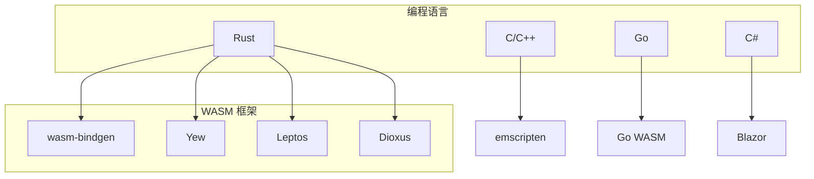

# 主流框架和库

WebAssembly 框架和库的全面指南。

## 概览



## Rust 框架

### Yew - Rust 版 React

```rust
use yew::prelude::*;

#[function_component(App)]
fn app() -> Html {
    let counter = use_state(|| 0);

    let onclick = {
        let counter = counter.clone();
        Callback::from(move |_| counter.set(*counter + 1))
    };

    html! {
        <div>
            <button {onclick}>{ format!("计数: {}", *counter) }</button>
        </div>
    }
}

fn main() {
    yew::start_app::<App>();
}
```

### Leptos - 细粒度响应式

```rust
use leptos::*;

#[component]
fn Counter() -> impl IntoView {
    let (count, set_count) = create_signal(0);

    view! {
        <button
            on:click=move |_| set_count.update(|n| *n += 1)>
            {count}
        </button>
    }
}

pub fn main() {
    mount_to_body(|| view! { <Counter /> });
}
```

### Dioxus - 跨平台 UI

```rust
use dioxus::prelude::*;

fn App() -> Element {
    let mut count = use_signal(0);

    rsx! {
        button { onclick: move |_| count += 1, "计数: {count}" }
    }
}

fn main() {
    launch(App);
}
```

## 工具链

### wasm-pack

| 命令 | 描述 |
|------|------|
| `wasm-pack build` | 构建包 |
| `wasm-pack test` | 运行测试 |
| `wasm-pack publish` | 发布到 npm |

### wasm-bindgen-cli

```bash
# 安装
cargo install wasm-bindgen-cli

# 生成绑定
wasm-bindgen target/wasm32-unknown-unknown/release/lib.wasm \
  --out-dir pkg \
  --target web
```

### wasm-opt

```bash
# 安装
cargo install wasm-opt

# 优化
wasm-opt -O3 input.wasm -o output.wasm

# 优化大小
wasm-opt -Oz input.wasm -o output.wasm
```

## C/C++ 与 Emscripten

```bash
# 安装 emscripten
git clone https://github.com/emscripten-core/emsdk.git
cd emsdk
./emsdk install latest
./emsdk activate latest
source ./emsdk_env.sh

# 编译 C 到 WASM
emcc input.c -o output.js
```

## 游戏引擎

### Bevy (Rust)

```rust
use bevy::prelude::*;

fn main() {
    App::new()
        .add_plugins(DefaultPlugins)
        .add_systems(Update, print_system)
        .run();
}

fn print_system(time: Res<Time>) {
    println!("时间: {}", time.elapsed_seconds());
}
```

## 测试

### Rust 测试

```rust
#[cfg(test)]
mod tests {
    use super::*;

    #[test]
    fn test_add() {
        assert_eq!(add(2, 3), 5);
    }

    #[test]
    fn test_fibonacci() {
        assert_eq!(fibonacci(10), 55);
    }
}
```

```bash
wasm-pack test --node
```

---

恭喜你完成了 WebAssembly 模块的学习！你现在可以开始构建真实的 WASM 应用程序了！

## 下一步

1. 构建你的第一个 Rust WASM 项目
2. 尝试使用 Yew 或 Leptos 构建 UI
3. 尝试使用 Emscripten 编译 C/C++
4. 探索 WASI 实现服务端 WASM

祝编码愉快！
